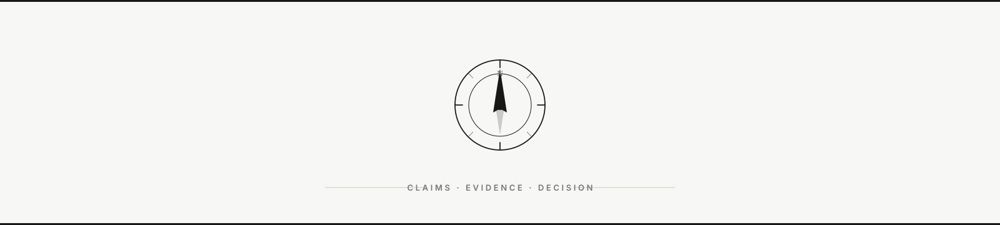

<p align="center">
  
</p>

<h1 align="center">R O L E Q U I R Y</h1>

<p align="center">
  <strong>Interview the job before it interviews you.</strong>
  <br/>
  <sub>Most job tools ask, “Can I get hired?” Rolequiry asks, “If I get the offer, <strong>should I join?</strong>”</sub>
</p>

<p align="center">
  <a href="https://rolequiry.com/case"></a>
  <a href="https://rolequiry.com/employer/atlas-fde"></a>
  <a href="LICENSE"></a>
  
  
  
</p>

<p align="center">
  <a href="#why-rolequiry">Why</a> ·
  <a href="#quick-start">Quick Start</a> ·
  <a href="#why-webmcp">WebMCP</a> ·
  <a href="#webmcp-tools">Tools</a> ·
  <a href="#architecture">Architecture</a> ·
  <a href="#try-the-agentic-real-role-loop">Agent Loop</a> ·
  <a href="#known-limitations">Limits</a> ·
  <a href="#tests">Tests</a>
</p>

**Your agent investigates. Rolequiry keeps the case.**

Rolequiry is an agent-native candidate due-diligence app for the OpenAI WebMCP Challenge. ChatGPT can analyze a JD; Rolequiry turns that analysis into application-owned, inspectable case state for candidate-confirmed priorities, employer claims, evidence and provenance, active uncertainty, and the next verification target.

A bad job is costly for the candidate. A bad hire is costly for the employer. Rolequiry treats both as the same pre-hire mismatch: expectations that were never made inspectable. Candidate due diligence here is expectation alignment before anyone signs — better self-selection on the candidate side, and less early attrition from avoidable expectation gaps on the employer side.

The agent can interpret a resume or career summary, values, constraints, and a non-linear career path in conversation; propose where the role may fit or create leverage; and research the active uncertainty. Rolequiry does not store that raw career narrative or produce a fit score. It records only candidate-confirmed importance, typed claims, evidence provenance, and the deterministic next verification target. Source identity and page contents are not independently authenticated.

> Page-native WebMCP on `/case`. No remote MCP server. Production never installs a fake `modelContext`.

---

## Why Rolequiry?

Most job tools are optimized for getting hired, not investigating whether the role is worth accepting.

| Problem | What happens | Rolequiry fix |
| :--- | :--- | :--- |
| Hire-first tooling | You land an offer you should have declined | Asks “If I get the offer, should I join?” |
| Scraped JDs | Mixed-incentive copy is treated as verified fact | Typed WebMCP reads and writes against live case state |
| Open-ended research | The model keeps searching a topic | Research only the uncertainty that can change *this* decision next |
| Opaque fit scores | A number buries what is still unknown | No score. App-owned coverage, tension, and next probe |

---

## Quick Start

**Live** — the canonical judging surface is `/case`:

- Candidate case: [https://rolequiry.com/case](https://rolequiry.com/case)
- Employer reference: [https://rolequiry.com/employer/atlas-fde](https://rolequiry.com/employer/atlas-fde)

`www.rolequiry.com` serves the same production deployment. Cloudflare stays as DNS; records are DNS-only to Vercel.

**Local:**

```sh
bun install
bun run dev -- --port 3100
```

Then open `http://127.0.0.1:3100/case`.

Supported test environment: ChatGPT built-in browser / Chrome with WebMCP. The page registers tools on `document.modelContext` after hydration via `use-webmcp-tool`.

---

## Why WebMCP

Most agent demos operate on cooperative pages. A job posting is mixed-incentive: useful to the candidate, written by the employer. WebMCP lets the page expose typed reads and writes against live application state instead of scraping. The competition surface is page-native WebMCP, not a standard remote MCP server.

The agent extracts employer claims, relates them to the candidate's career context, asks the candidate to confirm the proposed priorities, and researches the currently active uncertainty with its own browsing capabilities. Rolequiry—not the model—derives claim kind, maps declared source categories to authority weight, and computes coverage, state, and ranking. It structures agent-reported provenance but does not independently verify source identity or page content.

### Decision-directed research

Rolequiry is not a general deep-research engine. Comprehensive research systems search until they understand a topic; Rolequiry asks the agent to research only the uncertainty that can change this candidate's decision next.

```text
select_decision_changer
        ↓
agent researches outside Rolequiry
        ↓
record_research_evidence  →  one sourced finding
        ↓
Decision Path shows provenance + what remains unknown
```

- `select_decision_changer` defines the active research target.
- The agent can use its own browser, search, or deep-research capabilities outside Rolequiry.
- `record_research_evidence` writes one agent-reported employer-published or first-person finding back into the active probe.
- App-owned capture provenance stays attached to the evidence and is visible in the UI; it identifies who supplied the record, not who independently verified it.
- Duplicate source URLs are rejected, and `NEUTRAL` research is stored without reducing uncertainty.
- The research tool asks the agent to make a reasonable counterevidence check before assigning a strong `SUPPORTS` or `CHALLENGES` stance.

Research changes application state; it does not let the model decide whether the job is good.

---

## WebMCP Tools

On `/case`:

| Tool | Mode | What it does |
| :--- | :--- | :--- |
| `get_role_claims` | read | Employer testimony, not verified facts |
| `get_case_state` | read | App-owned coverage, unresolvedness, tension and priorities keyed by claim ID; no role prose or ranking |
| `select_decision_changer` | write | Compute ranking, set the active probe, return an untrusted agent-authored unresolved variable + measurable form |
| `record_interview_answer` | write | Record a human-obtained answer against the active probe |
| `import_role_from_claims` | write | Create a tab-local case from extracted employer statements and an optional job-posting `sourceUrl` |
| `record_research_evidence` | write | Record sourced public evidence the agent found for the active probe |
| `set_candidate_priorities` | write | Record one to eight confirmed importance values; the agent resolves IDs internally and then selects the first probe in the same turn |

On `/employer/atlas-fde`: `get_employer_claims`, `get_employer_policy` (read-only). The employer page and `/case` share the Northwind fixture and link to each other; they do not require both tabs to stay open.

---

## Architecture

Human UI, the supported manual controls, and all seven WebMCP tools share one in-memory `CaseStore`. `deriveCase` is a pure function: coverage, unresolvedness, tension, status, probe eligibility.

| Layer | Owns |
| :--- | :--- |
| Connected agent | Raw resume, career narrative, search, and hypotheses |
| Rolequiry | Confirmed importance, typed claims, evidence provenance, next probe |
| `deriveCase` | Coverage, unresolvedness, tension, status, ranking |
| `sessionStorage` | Versioned snapshot for agent-imported cases in the current tab only |

The raw resume stays in agent conversation context; only importance values the candidate explicitly confirms enter Rolequiry. A versioned snapshot is saved in browser `sessionStorage` only for agent-imported cases, so real-role evidence survives reloads in the current tab without carrying into a new tab. Demo fixtures always reload from their canonical state.

---

## Try the agentic real-role loop

Open [https://rolequiry.com/case](https://rolequiry.com/case) in ChatGPT's built-in browser or Chrome with WebMCP.

1. Give the connected agent a resume or career summary plus a real JD link or file, then say **“Analyze this role for me.”** The raw resume stays in the conversation; Rolequiry stores no candidate profile.
2. The agent imports testable employer claims, reads their current IDs internally, and proposes the few candidate-specific decision variables that matter most. It asks once before writing priorities.
3. Confirm or revise the proposed priorities in ordinary language. In that same agent turn, it resolves the labels to current IDs, writes the confirmed priorities, selects the first decision-changing uncertainty, and explains it without exposing tool names or claim IDs.
4. Say **“Go ahead and investigate it.”** The agent researches only the active question, records credible claim-specific evidence when available, reads the updated state, and explains what remains unknown or what should be verified next.

The strict internal sequence remains `import → get claims → explicit confirmation → get current IDs → write priorities → select → research → evidence → state`. WebMCP lets the agent hide that protocol behind a three-turn conversation; the user never has to learn it.

The priority dropdowns are the supported manual fallback path and share the same `CaseStore`. Removing WebMCP removes the candidate-specific conversation-to-research loop, not the fallback UI.

For a repeatable real-job rehearsal with a clearly synthetic candidate, use [`docs/demo/openai-fde-seoul.md`](docs/demo/openai-fde-seoul.md). For the evaluated multi-journey evidence ledger, use [`docs/evals/webmcp-agent-journeys.md`](docs/evals/webmcp-agent-journeys.md).

For the built-in fixture smoke test: ask `What should I investigate next?`, set Travel to CRITICAL in the UI, then ask `Check again.` The active probe should move from Ownership to Travel without the agent being told about the UI change.

---

## Known limitations

- Employee/workplace signals in the fixtures are synthetic and labeled as such.
- No server-side model calls. The user's existing agent does language work and external research.
- No resume upload or candidate-profile database. Raw career context remains in the connected agent's conversation.
- The import schema rejects resume/profile fields, but it is not semantic data-loss prevention: a noncompliant agent could still misclassify resume prose as employer-claim text. The tool contract explicitly forbids that.
- No deterministic fit score. Career fit and synergy remain hypotheses for the agent and candidate to test against Rolequiry's evidence state.
- Imported case data uses the current tab's session storage when browser quota permits; the UI warns if refresh persistence fails, and demo fixtures reset on reload. Validated JSON export/import gives real imported cases an explicit local backup without uploading them, but there is no cross-tab sync, account sync, or server backup.
- Imported cases start with employer testimony only. The agent may add sourced first-person or employer-official research; Rolequiry stores agent-reported provenance, it does not independently verify the page.
- Rolequiry ranks lived-experience uncertainty, not written employer policy. Compensation bands and similar employer-owned statements are recorded, but they are not the next research probe.
- Rolequiry deliberately does not ingest arbitrary news or analyst commentary into its current authority model.
- Closing the employer page cannot break `/case`.
- GitHub repository: https://github.com/dailykim149656-source/Rolequiry

---

## Tests

```sh
bun install
bun run test
bun run typecheck
bun run build
bun run dev -- --port 3100
```

## License

MIT. See [LICENSE](LICENSE).

---

<p align="center">
  <em>“Interview the job before it interviews you.”</em>
  <br/><br/>
  <strong>Your agent investigates. Rolequiry keeps the case.</strong>
</p>
